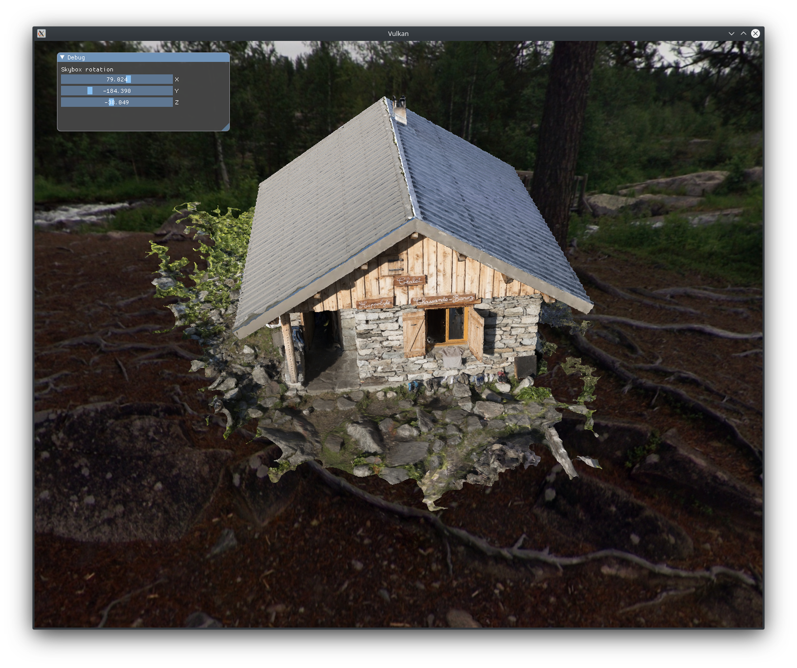

# Shallow water simulation 💦

My attempts at Vulkan programming based on examples by [Overv](https://github.com/Overv/VulkanTutorial) and [Sascha Willems](https://github.com/SaschaWillems/Vulkan)

# Controls 🕹️

- **WASD+mouse** - 3D movement
- **Q/E** - roll the camera
- **Space/Backspace** - move up or down non-relative to the camera
- **Right mouse button** - send distortion to the water
- **R** - show water's vertex grid
- **Escape** - stop registering mouse movement
